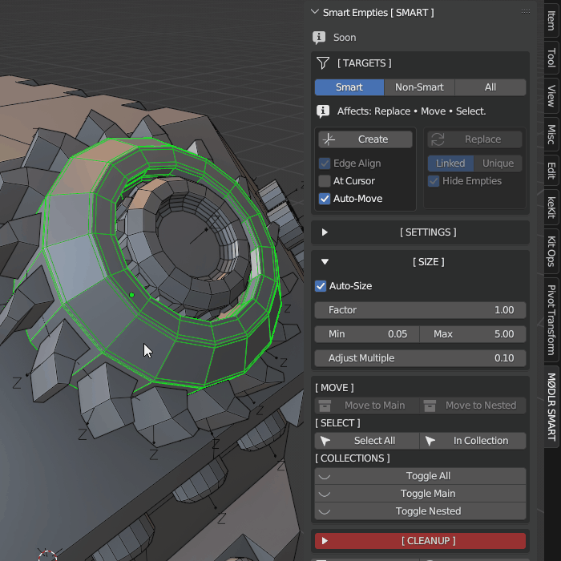
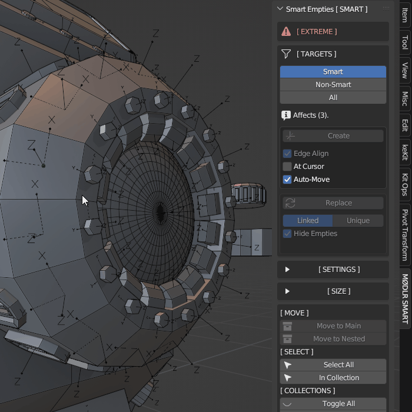
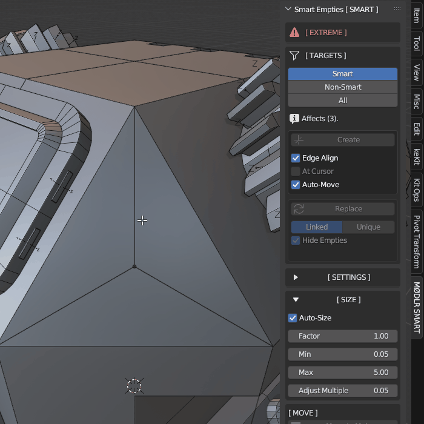
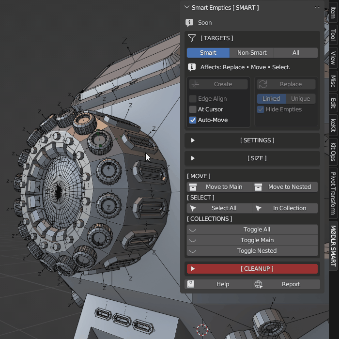
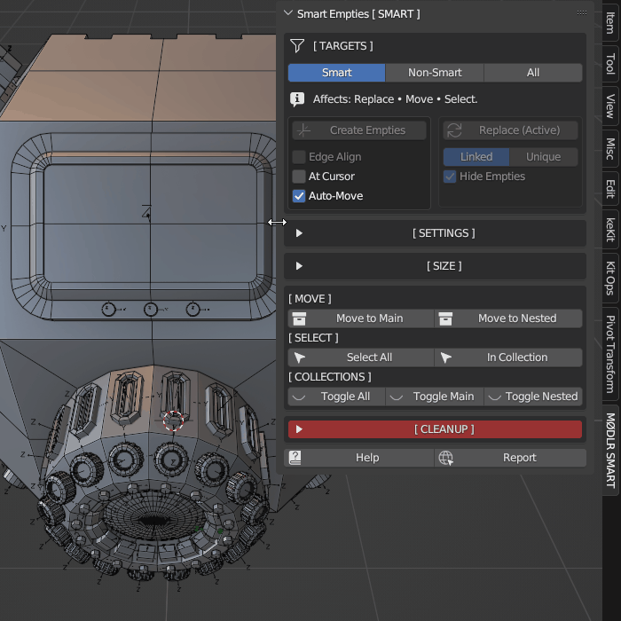
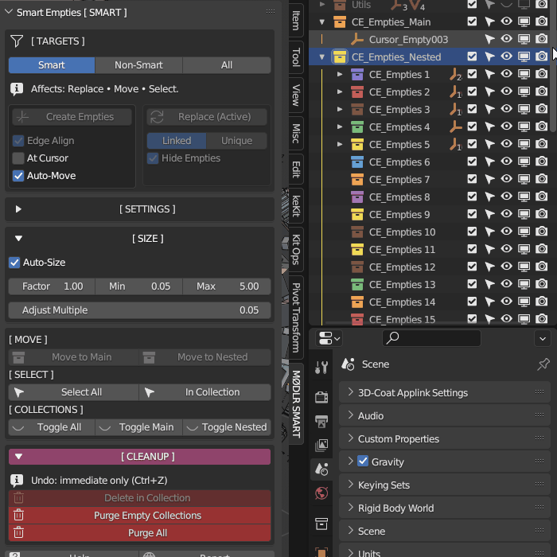
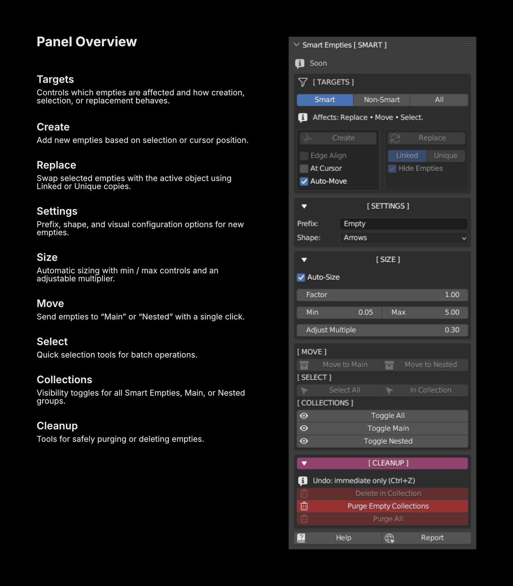

# Smart Empties · MØDLR SMART Tools

Precision empty placement and management for Blender — **fast, deterministic, and undo-safe**. 
Part of the **MØDLR SMART Tools** suite. 
 
 
*Each section builds on the last — read top to bottom for full context.*

---

## Overview
*Built for modelers who care about precision, structure, and speed:*

**Smart Empties** extends Blender’s Empty system with intelligent creation, organization, and replacement tools designed for speed, precision, and control. It transforms empties from simple helpers into context-aware anchors that streamline placement, assembly, and scene management.

---

## Usage Preview

Here are short examples showing Smart Empties in action.
These clips demonstrate the core workflows, speed, and clarity of the system.

 
<table>
  <tr>
    <td width="50%"></td>
    <td width="50%"></td>
  </tr>
  <tr>
    <td width="50%"></td>
    <td width="50%"></td>
  </tr>    
  <tr>
    <td width="50%"></td>
    <td width="50%"></td>
  </tr>
</table>
 

## N-Panel Menu

Below is the main Smart Empties panel.The screenshot on the right shows the interface, while the notes on the left explain what each section controls.

 

 

---

## Key Features
*Highlights at a glance:*

#### Placement & Creation
- **Smart Placement:** Create empties from mesh selections, objects, or the 3D Cursor with deterministic alignment and clear tagging for predictable results.
- **Flexible Alignment:** Placement modes ensure consistent orientation across triangles, quads, and N-gons — maintaining accuracy even on complex surfaces.

#### Behavior & Control
- **Context-Aware Behavior:** Operators adapt to mode and selection type — always behaves as expected, no surprises or mismatched results.
- **Auto Functions:** Optional Auto-Move and Auto-Size features organize and scale empties during creation — keeping scenes clean and consistent without manual tweaking.

#### Replace & Adjust
- **Replace System:** Instantly replace empties with **Linked** or **Unique** duplicates — originals can be automatically hidden with **Hide Empties** for a cleaner, safer scene structure.
- **Adjust Tools:** Apply changes to all selected smart empties automatically — no need for Blender’s often-overlooked *Alt multi-edit* shortcut; it just works across your selection.

#### Visibility & Workflow
- **Smart Selection & Visibility:** One-click select, move, or toggle visibility of smart empties, non-smart empties, or both — simplifies navigation and organization at scale.
- **Undo-Safe Workflow:** Every operation is fully reversible using Blender’s standard undo stack — stable, predictable, and built for production use.

---

## Philosophy
*The behavior is intentional:*

Smart Empties follows three principles:
1. **Good-first-click:** Every operator produces an immediate, useful result.
2. **Graceful failure:** No unpredictable behavior or silent breaks.
3. **Undo is sacred:** Every operation is safe to reverse.

**Deliberate safety:** Cleanup operations always require confirmation — destructive actions are never automatic.

Every action reinforces trust — what you see is what you get, every time.

---

## Compatibility & Performance
*Under the hood, it behaves like a native tool:*

- **Dependencies:** None — built entirely on Blender’s standard API.
- **Blender:** Fully tested in 3.3 LTS and 3.6 LTS.
  Designed to work beyond these versions — built on Blender’s standard API with no deprecated calls.
- **Performance:** In internal tests, handles very high empty counts; real-world limits vary by scene complexity and hardware.
- **UI Tested:** Responsive breakpoint system verified across all N-panel widths — stable from Standard (≥360 px) to Extreme (≈240 px).

*Performance validation is ongoing. Beta feedback and real-world scene testing will continue refining optimization targets and confirming large-scale limits — part of MØDLR’s mission to keep improving precision, speed, and reliability.*

Feels native. Performs like it belongs.

---

## Roadmap
*Where it’s headed next:*

Smart Empties continues to evolve — expanding performance, flexibility, and ecosystem integration with every update.

#### Core Expansions
- **Vertex & Edge Support:** Create empties directly from vertices and edges for full mesh-component coverage and precise anchor placement.
- **Smarter Collection Routing:** Replace outputs auto-route into **Smart** or **Nested** collections — preserving structure, hierarchy, and tags.

#### Interaction & Feedback
- **Ghost Preview:** Lightweight visual feedback before confirming placement — improves confidence and accuracy in complex scenes.
- **Modal Rotate:** Adjust orientation immediately after creation — stay in the flow without leaving the operator.

#### Scaling & Access
- **Range-Based Adjust Scaling:** Enhanced multi-empty scaling that maintains proportions or applies controlled variation.
- **Popup Quick Menu:** Assignable shortcut menu for core Smart Empties actions — instant access directly in the viewport.

#### Ecosystem Integration
- Smart Empties is designed to feel at home within the broader MØDLR workflow.
As the ecosystem evolves, there may be opportunities for deeper cross-tool improvements and shared quality-of-life behavior.
- **Future Additions:** Advanced N-gon placement, safer Purge, adaptive alignment, and ongoing performance refinements.

Always moving forward — built to keep getting smarter.

---

## Known Limitations
*Current guardrails:*

- **Output Routing:** Replace results currently appear in the Scene Collection by default — user-defined routing and smarter hierarchy options are planned for later versions.
- **N-gon Handling:** Complex faces use simplified centers for placement — advanced geometric precision and refined N-gon logic are planned for future updates.
- **Selection Behavior:** Selection outcomes vary by operation — refinement and smarter reselect handling are expected as the system evolves.
- **Multi-Scene Scope:** Operators act within the active scene only — broader scene awareness and cross-scene routing are being considered for later development.
- **Visual Preview:** Objects appear instantly upon creation — adding visual cues, placement previews, and ghost indicators is being considered.

*These limits are deliberate — each one ensures predictable behavior until the smarter systems roll out.*

---

## About MØDLR SMART Tools
*The ecosystem behind Smart Empties:*

**MØDLR SMART Tools** is a collection of high-performance Blender add-ons built for precision, polish, and creative flow. Each tool stands on its own but follows a shared design philosophy: fast interaction, minimal friction, and clean, predictable workflows.

Every add-on is fully independent yet immediately familiar — consistent controls, aligned behavior, and a modern, production-minded experience.

*Modular by design. Connected by purpose.*

---

## Support & Feedback
- **Website:** [modlr.tools](https://modlr.tools)
- **Support:** [support@modlr.tools](mailto:support@modlr.tools)
- **Studio Contact:** [studio@modlr.tools](mailto:studio@modlr.tools)

---

© 2025 MØD:LR  •  MØDLR Studio 
Part of the **MØDLR SMART Tools** suite.
